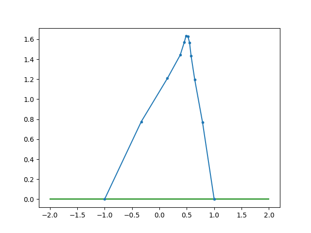
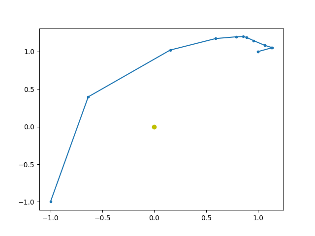
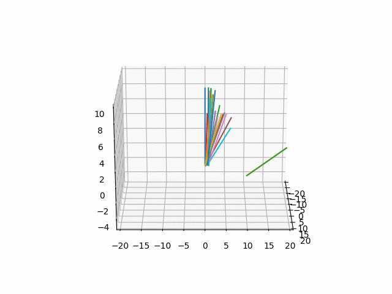

I'm a CS major in a physics class, which means that all optimization problems
just look like opportunities for gradient descent... here I use PyTorch's
automatic differentiation tools to try and optimize the "action" of a physical
system (in the Lagrangian sense) in order to "learn" its true trajectory -- a
visual display of the Principle of Stationary Action!

## Some demos

All of these are seeded with random trajectories and left to tune for a few
thousand steps of gradient descent, just a few minutes of total computation
time.

### Trajectory of a projectile

### Keplerian Orbit

### Spherical Cart-Pole

